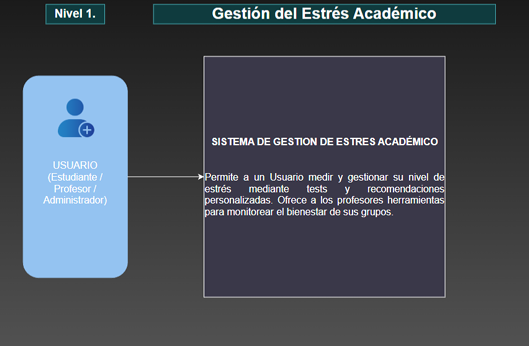
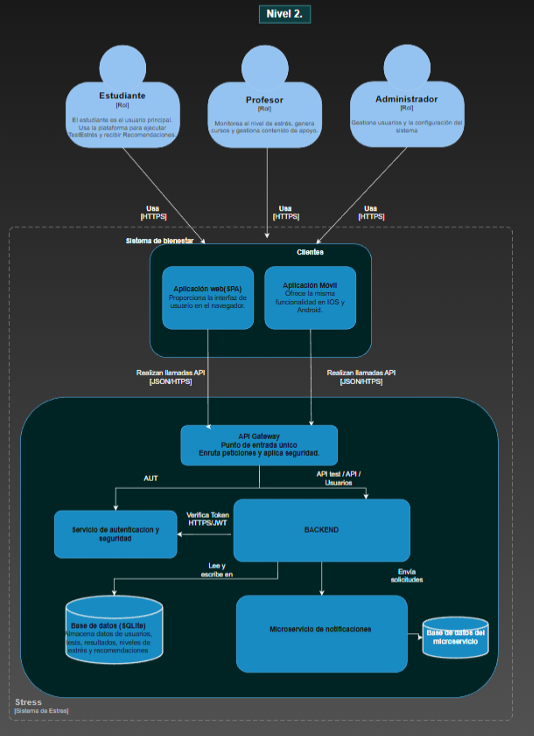
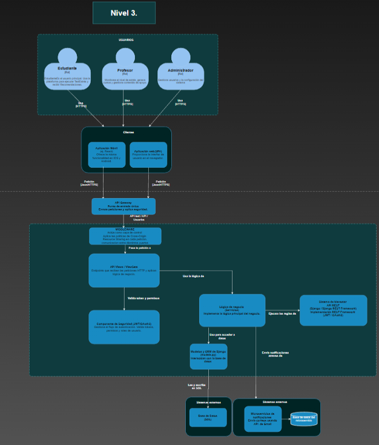
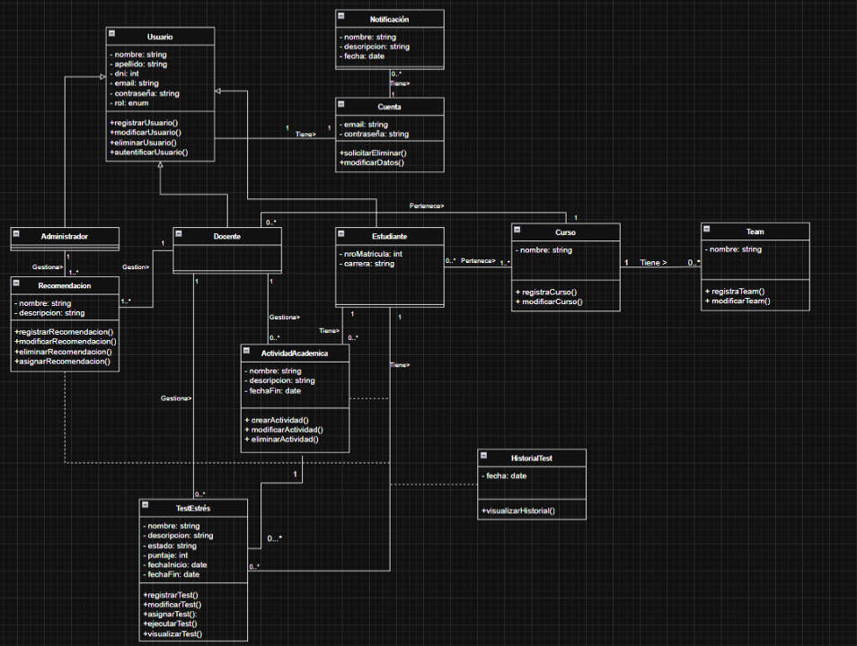

La arquitectura se documenta utilizando el modelo C4 para visualizar las abstracciones por niveles.

## Nivel 1: Diagrama de Contexto
Muestra el sistema en el centro y sus interacciones con actores externos.

---

## Nivel 2: Diagrama de Contenedores
Muestra las aplicaciones desplegables y bases de datos.

---

## Nivel 3: Diagrama de Componentes (API Backend)
Detalle interno del contenedor "Backend API".

---

## Nivel 4: Diagrama de Código (Modelo Principal)
Detalle de la clase principal del dominio.

