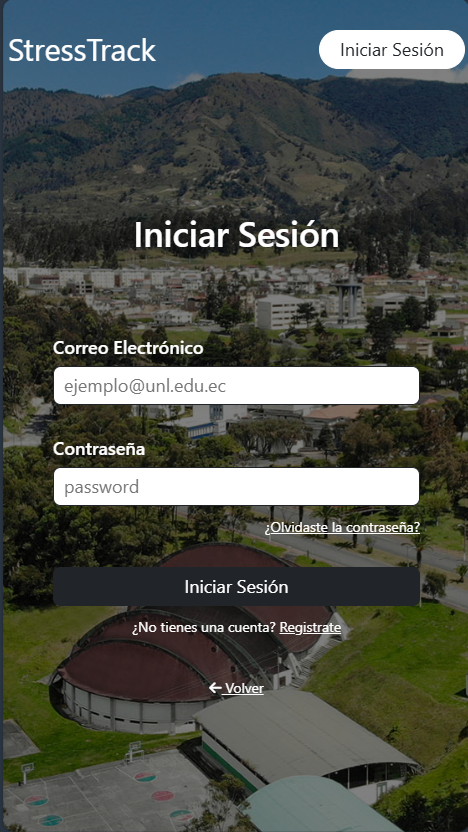
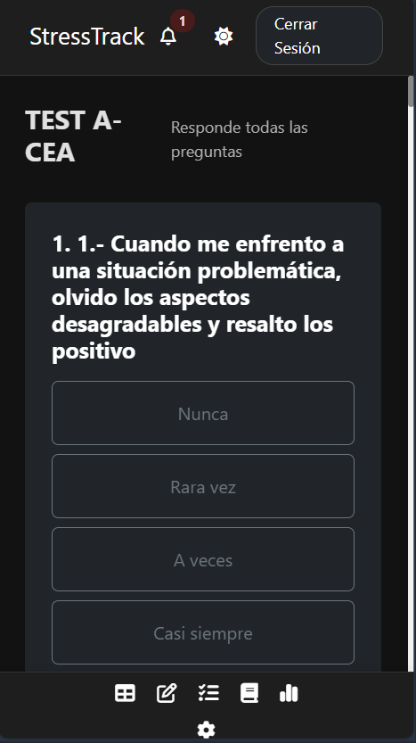

## 1. Introducción
La aplicación permite a los estudiantes gestionar sus niveles de estrés académico tanto desde el navegador web como desde sus dispositivos móviles Android.

## 2. Acceso al Sistema

### Versión Web
1. Navegue a la URL proporcionada.
2. Ingrese sus credenciales institucionales.

### Versión Móvil
1. Abra la app **StressTrack** en su celular.

{width=300}

## 3. Funcionalidad Principal: Realizar Tets

Para realizar un nuevo Test:

1.  Vaya al apartado de **Tests** en el **Dashboard**.
2.  Seleccione un test si tiene disponible.
3.  Selecione las casillas correspondiente a cada pregunta.
4.  Pulse **Terminar Test**.

{width=300}

::: {.callout-tip}
**Sincronización:** Los datos guardados en el móvil se reflejan instantáneamente en la versión web y viceversa.
:::