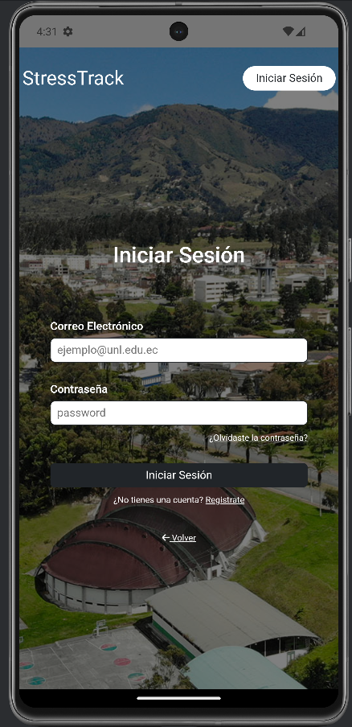
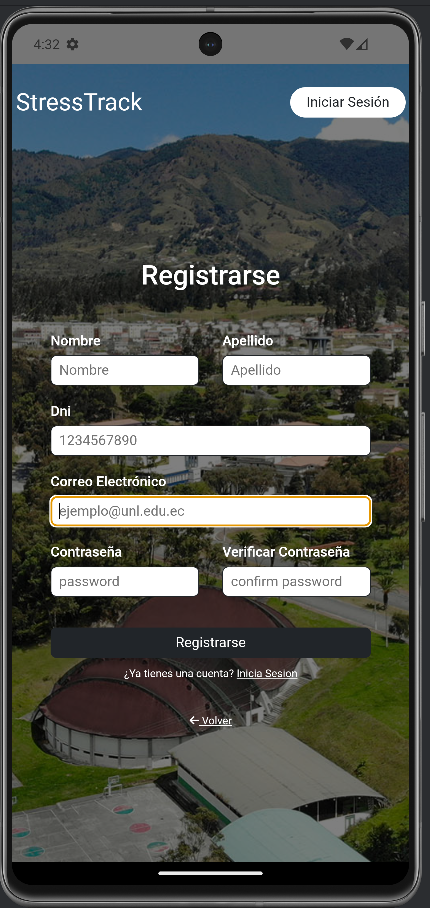
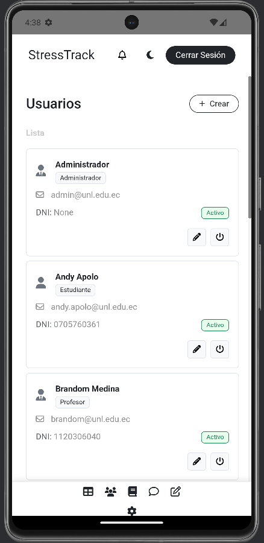

# Documentación de Integración Móvil (StressTrack App)

Este documento detalla la integración de la aplicación web Django existente con el entorno móvil utilizando **Capacitor**. La aplicación funciona como un cliente híbrido que consume tanto las vistas renderizadas por el servidor (HTML) como endpoints de API para funcionalidades asíncronas.

## 1. Endpoints Consumidos

La aplicación móvil se comunica con el servidor backend alojado localmente (durante desarrollo en `http://10.0.2.2:8000`).

### Listado de Rutas Principales
| Método | Endpoint (Ruta Relativa) | Descripción |
| :--- | :--- | :--- |
| **GET** | `/` | Vista principal (Dashboard/Home). |
| **GET** | `/login/` | Pantalla de autenticación de usuarios. |
| **POST** | `/tests/` | Envío de nuevo registro de nivel de estrés. |

---

## 2. Ejemplo de Solicitud y Respuesta

A continuación, se documenta el consumo del endpoint de **Registro de Estrés** (`/tests/`), utilizado para enviar datos desde el móvil sin recargar la página completa.

### Solicitud (Request)
**URL:** `http://10.0.2.2:8000/tests/`
**Método:** `POST`
**Headers:**
* `Content-Type: application/json`
* `X-CSRFToken: [token_csrf]`

**Body (JSON):**
```json
{
  "usuario_id": 1,
  "nivel_estres": 7,
  "actividad": "Examen final de redes",
  "fecha": "2026-02-01T10:30:00"
}
```
**Codigo de estado**
```json
{
  "status": "success",
  "message": "Registro guardado exitosamente.",
  "data": {
    "id": 45,
    "registrado_el": "2026-02-01T10:30:05"
  }
}
```
---

## 3. Capturas de Pantalla de la App en Ejecución

A continuación se evidencia el funcionamiento de la aplicación en el emulador Android (Pixel API 30+).

### Pantalla de Inicio (Login/Dashboard)



### Formulario de Registro



### Visualización de Datos




